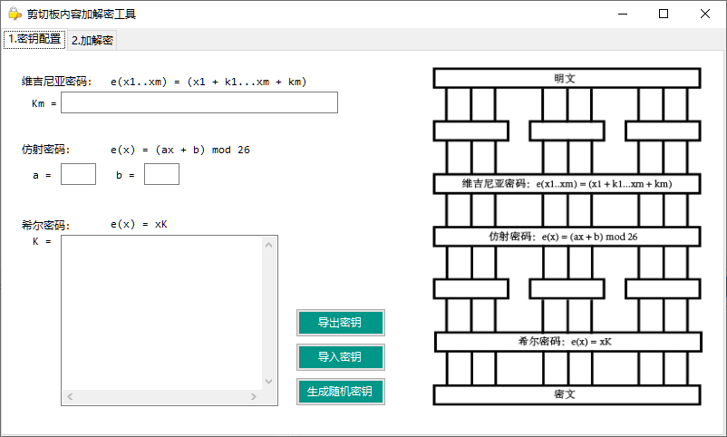
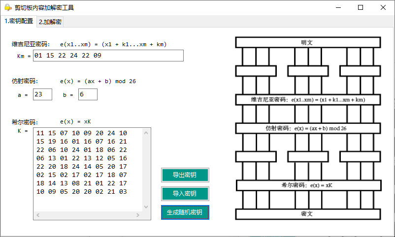
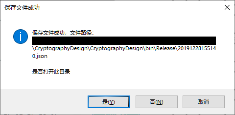
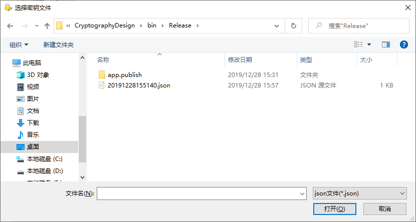
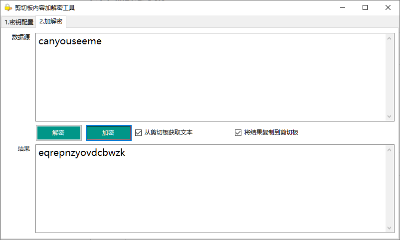
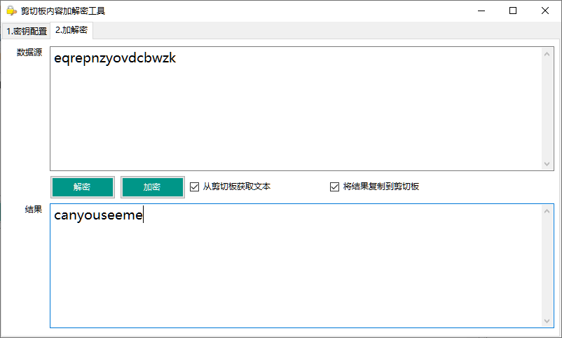

# 密码学大作业
自定义一种加密算法及其编程实现

[TOC]

## 1. 加密原理

|明文空间|明文长度|密文空间|密文长度|
|:-:|:-:|:-:|:-:|
|a-z|大于1|a-z|希尔密码加密矩阵阶数的整数倍|

|加密顺序|解密顺序|
|-|-|
|明文|密文|
|维吉尼亚密码|希尔密码|
|仿射密码|仿射密码|
|希尔密码|维吉尼亚密码|
|密文|明文|


### 1.1. 维吉尼亚密码

加密函数：
$$
e_K(x_1, x_2, ... x_m) = (x_1 + k_1, x_2 + k_2, ... x_m + k_m)
$$

解密函数：

$$
d_K(y_1, y_2, ... y_m) = (y_1 - k_1, y_2 - k_2, ... y_m - k_m)
$$

加密时，将数据进行分组。每个分组长度为 $$m$$。如果最后一个分组不足 $$m$$ 位，只有 $$n$$ 位 $$(n<m)$$，则只加密这前 $$n$$ 位。

### 1.2. 仿射密码

加密函数：

$$
e(x) = (ax + b) \mod m
$$

解密函数：

$$
d(y) = a^{-1} (y - b) \mod m
$$

其中 $$a$$ 和 $$m$$ 互素，如果 m = 26, 则 $$a \in \{1,3,5,7,9,11,15,17,19,21,23,25\}$$

### 1.3. 希尔密码

加密函数：

$$
e_K(x) = xK
$$

解密函数：
$$
dk(y) = yK^{-1}
$$

其中密钥 K 为可逆方阵

#### 1.3.1. 加密矩阵在有限域下求逆

设矩阵 $$A$$ 可逆，$$A^-$$ 为其逆矩阵，$$D$$ 为其行列式，$$A^*$$为其伴随矩阵，则有

$$
A^- = \frac{A*}{D} = A^*  D^-
$$

其中 $$D^-$$ 为 $$D$$ 在模 $$m$$下的逆元，以上运算均在模 $$m$$ 下计算。

#### 1.3.2. 加密

假如有如下明文：

| 明文序号 |  1   |  2   |  3   |  4   |  5   |  6   |  7   |  8   |  9   |  10  |
| :------: | :--: | :--: | :--: | :--: | :--: | :--: | :--: | :--: | :--: | :--: |
| 对应的值 |  12  |  0   |  1   |  6   |  18  |  25  |  6   |  20  |  25  |  25  |

##### 1.3.2.1. 先对明文进行处理，加上终结符

根据统计，词频最低的为 z = 0.08，z 对应的是 25，即在明文中 z 出现的频率比较低，将采用 25 作为明文的终结符。所以，加密时如果遇到 25，需要将其转义，将其换成 2 个 25。

分析如上明文，将所有的25都换成两个25，得到如下明文：

| 序号 |  1   |  2   |  3   |  4   |  5   |  6   |  7   |  8   |  9   |  10  |  11  |   12   |   13   |
| :--: | :--: | :--: | :--: | :--: | :--: | :--: | :--: | :--: | :--: | :--: | :--: | :----: | :----: |
|  值  |  12  |  0   |  1   |  6   |  18  |  25  |  25  |  6   |  20  |  25  |  25  | **25** | **25** |

​	在明文的最后加上一个25，作为终结符，得到如下密文：

| 序号 |  1   |  2   |  3   |  4   |  5   |  6   |  7   |  8   |  9   |  10  |  11  |  12  |  13  |   14   |
| :--: | :--: | :--: | :--: | :--: | :--: | :--: | :--: | :--: | :--: | :--: | :--: | :--: | :--: | :----: |
|  值  |  12  |  0   |  1   |  6   |  18  |  25  |  25  |  6   |  20  |  25  |  25  |  25  |  25  | **25** |

##### 1.3.2.2. 填充分组

   对明文进行分组，最后一组不足的补充0（也可以填充随机值，但是不便于分析，这里就先简单填充相同的字符）。如果分组长度位8，则得到如下密文：

| 序号 |  1   |  2   |  3   |  4   |  5   |  6   |  7   |  8   |  9   |  10  |  11  |  12  |  13  |  14  |  15   |  16   |
| :--: | :--: | :--: | :--: | :--: | :--: | :--: | :--: | :--: | :--: | :--: | :--: | :--: | :--: | :--: | :---: | :---: |
|  值  |  12  |  0   |  1   |  6   |  18  |  25  |  25  |  6   |  20  |  25  |  25  |  25  |  25  |  25  | **0** | **0** |

##### 1.3.2.3. 加密

| 序号 |  1   |  2   |  3   |  4   |  5   |  6   |  7   |  8   |  9   |  10  |  11  |  12  |  13  |  14  |  15   |  16   |
| :--: | :--: | :--: | :--: | :--: | :--: | :--: | :--: | :--: | :--: | :--: | :--: | :--: | :--: | :--: | :---: | :---: |
|  值  |  12  |  0   |  1   |  6   |  18  |  25  |  25  |  6   |  20  |  25  |  25  |  25  |  25  |  25  | **0** | **0** |

​	对每个分组进行矩阵加密

##### 1.3.2.4. 至此，加密结束，只需将数字转换成对应的字母即可

#### 1.3.3. 解密

如果密文分组后，最后一组不是完整的组，说明密文和密钥不匹配，无法解密。如果分组正常，则使用和加密相反的过程。

##### 1.3.3.1. 解密

   使用矩阵解密每一个分组。假如解密后得到如下明文：

| 序号 |  1   |  2   |  3   |  4   |  5   |  6   |  7   |  8   |  9   |  10  |  11  |  12  |  13  |  14  |  15  |  16  |
| :--: | :--: | :--: | :--: | :--: | :--: | :--: | :--: | :--: | :--: | :--: | :--: | :--: | :--: | :--: | :--: | :--: |
|  值  |  12  |  0   |  1   |  6   |  18  |  25  |  25  |  6   |  20  |  25  |  25  |  25  |  25  |  25  |  0   |  0   |

##### 1.3.3.2. 去除填充数据

   从前往后，找到终结符 25 的下标，然后将其本身以及后面的所有数据删除，得到如下明文：

| 序号 |  1   |  2   |  3   |  4   |  5   |  6   |  7   |  8   |  9   |  10  |  11  |  12  |  13  |
| :--: | :--: | :--: | :--: | :--: | :--: | :--: | :--: | :--: | :--: | :--: | :--: | :--: | :--: |
|  值  |  12  |  0   |  1   |  6   |  18  |  25  |  25  |  6   |  20  |  25  |  25  |  25  |  25  |

##### 1.3.3.3. 将两个连续的25合并为一个，得到如下明文：

| 序号 |  1   |  2   |  3   |  4   |  5   |  6   |  7   |  8   |  9   |  10  |
| :--: | :--: | :--: | :--: | :--: | :--: | :--: | :--: | :--: | :--: | :--: |
|  值  |  12  |  0   |  1   |  6   |  18  |  25  |  6   |  20  |  25  |  25  |

##### 1.3.3.4. 至此，解密结束，只需将序号

## 2. 编程实现

使用C#开发的winform程序。

### 2.1. 界面效果

#### 2.1.1 密钥配置

- 应用打开后，需要用户配置密钥。如果不想自己输入，可以点击“生成随机密钥”按钮。



- 生成随机密钥



- 生成随机密钥后，可以点击“导出密钥”按钮，程序会将密钥保存为“json”文件，然后可以将密钥发送给他人。
  - 弹窗提示保存成功

  - 可以打开看一下，格式如下

    ```json
    {
      "InvalidIntValue": 2147483647,
      "VigenereKey": [ 1, 15, 22, 24, 22, 9 ],
      "AffineKeyA": 23,
      "AffineKeyB": 6,
      "HillMatrix": [ 
        [   11,   15,    7,   10,    9,   20,   24,   10 ], 
        [   15,   19,   16,    1,   16,    7,   16,   21 ], 
        [   22,    6,   10,   24,    1,   18,    6,   22 ], 
        [    6,   13,    1,   22,   13,   12,    5,   16 ], 
        [   22,   20,   18,   24,   14,    5,   20,   17 ],
        [    2,   15,    2,   17,    2,   17,   18,   7 ], 
        [   18,   14,   13,    8,   21,    1,   22,   17 ], 
        [   10,    9,    5,   20,   20,    2,   21,   3 ]
      ],
      "AllKeysReady": true
    }
    ```

- 如果需要解密他人的密文，可以点击“导入密钥”按钮来导入对方的密钥。



#### 2.1.2 加解密文本

- 如果勾选“将结果复制到剪切板”，当执行加密操作时，会将密文直接复制到剪切板，便于直接粘贴给别人。
- 如果勾选“从剪切板获取文本”，当执行解密操作时，会从剪切板读取文本解密

- 开始使用加解密功能，输入待加密的字母，点击“加密”按钮



- 将密文复制到“数据源”中，点击“解密”按钮即可得到明文。（如果勾选了“从剪切板获取文本”则可以直接点击解密按钮，程序会自动把剪切板中的密文填充到“数据源”中，并执行解密操作）



### 2.2. 部分源码

#### 2.2.1 维吉尼亚密码

```c#
// 加密
public List<char> Decrypt(List<char> cipher)
{
    var result = new List<char>();
    int groupLength = vigenereKey.Length;

    for (int i = 0; i < cipher.Count; i++)
    {
        var _ = cipher[i] - vigenereKey[i % groupLength];
        result.Add((char)((_ % m + m) % m));
    }

    return result;
}

// 解密
public List<char> Encrypt(List<char> plain)
{
    var result = new List<char>();
    int groupLength = vigenereKey.Length;

    for (int i = 0; i < plain.Count; i++)
    {
        var _ = plain[i] + vigenereKey[i % groupLength];
        result.Add((char)(_ % m));
    }

    return result;
}
```

#### 2.2.2 仿射密码

```c#
// 解密
public List<char> Decrypt(List<char> cipher)
{
    int ap = AAP[a]; // a的逆元
    for (int i = 0; i < cipher.Count; i++)
    {
        cipher[i] = (char)(((ap * (cipher[i] - b)) % 26 + 26) % 26);
    }
    return cipher;
}

// 加密
public List<char> Encrypt(List<char> plain)
{
    for (int i = 0; i < plain.Count; i++)
    {
        plain[i] = (char)(((a * plain[i] + b) % 26 + 26) % 26);
    }
    return plain;
}
```

#### 2.2.3 希尔密码

```C#
// 解密
public List<char> Decrypt(List<char> cipher)
{
    // TODO Delete
    //PrintList(cipher, "[解密前]");

    if (cipher.Count % groupLength != 0)
    {
        throw new FormatException("密文的格式出错，请检查是否缺失数据");
    }

    // 解密
    int groupNums = cipher.Count / groupLength;   // 总分组数
    List<char> result = new List<char>();   // 结果

    for (int i = 0; i < groupNums; i++)
    {
        // 使用加密矩阵将分组解密，然后添加到结果中
        result.AddRange(
            MatrixIntGF26.MultiplyMod26(
                cipher.GetRange(i * groupLength, groupLength).ToArray(), 
                DKEY
            )
        );
    }

    // 去冗余，去除终结符之后的数据
    var index = result.LastIndexOf(Transfer_Char);
    if (index == -1)
    {
        throw new Exception("数据出错，或者数据和希尔密码的密钥不匹配");
    }
    result.RemoveRange(index, result.Count - index);

    // 合并连续的两个终结符
    for (int i = 1; i < result.Count; i++)
    {
        if (result[i] == Transfer_Char)
        {
            if (result[i - 1] == Transfer_Char)
            {
                result.RemoveAt(i);
            }
        }
    }

    return result;
}

```
```c#
// 加密
public List<char> Encrypt(List<char> plain)
{
    // 拷贝plain
    var copy = new List<char>();
    for (int i = 0; i < plain.Count; i++)
    {
        copy.Add(plain[i]);
    }

    // 将终结符转义，即将一个终结符换成两个连续的终结符
    for (int i = 0; i < copy.Count; i++)
    {
        if (copy[i] == Transfer_Char)
        {
            copy.Insert(i, Transfer_Char);
            i++;
        }
    }

    // 在数据的最后加上终结符
    copy.Add(Transfer_Char);

    // 检查数据总长度，如果最后一组数量不够，需要填充数据
    int appendLength = copy.Count % groupLength;// 填充数
    if (appendLength != 0)
    {
        appendLength = groupLength - appendLength;
    }

    for (int i = 0; i < appendLength; i++)
    {
        copy.Add(Append_Char);
    }
    
	// 总分组数
    int groupNums = copy.Count / groupLength + ((copy.Count % groupLength) == 0 ? 0 : 1);   

    List<char> result = new List<char>();   // 结果
    for (int i = 0; i < groupNums; i++)
    {
        // 使用加密矩阵将分组加密，然后添加到结果中
        result.AddRange(
            MatrixIntGF26.MultiplyMod26(
                copy.GetRange(
                    i * groupLength, groupLength).ToArray(), 
                	EKEY
            )
        );
    }

    return result;
}
```

#### 2.2.4 希尔密码辅助类

用来提供mod26下矩阵的乘法运算以及矩阵求逆等运算。代码比较多，就不展示了

